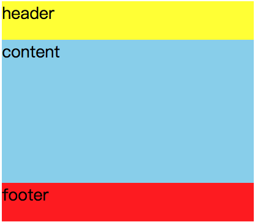

# interview

## HTML/CSS

- 1.什么是语义化的HTML,语义化的HTML有什么用?

可以分,对用户、开发者、搜索引擎优化来回答

- 2.行内元素和块级元素的区别,分别举例3个

- 3.清楚浮动的方式有哪些

- 4.盒模型由什么哪些组成? 


- 5.解释什么是外边距合并现象 (或者看代码回答,给brother2元素添加margin-top:60px后会发生什么)


```
<!DOCTYPE html>
<html lang="en">
<head>
    <meta charset="UTF-8">
    <title>Title</title>
    <style>
        .brother1 {
            width: 100px;
            height: 100px;
            background: blue;
            margin-bottom: 40px;
        }

        .brother2 {
            width: 100px;
            height: 100px;
            background: red;
        }
    </style>
</head>
<body>
    <div class="brother1"></div>
    <div class="brother2"></div>
</body>
</html>

```

- 6.解释什么是外边距的塌陷现象 (或者看代码回答,给child元素添加margin-top:60px后会发生什么)

```
<!DOCTYPE html>
<html lang="en">
<head>
    <meta charset="UTF-8">
    <title>Title</title>
    <style>
        .father {
            width: 200px;
            height: 200px;
            background: blue;
        }

        .child {
            width: 100px;
            height: 100px;
            background: red;
        }
    </style>
</head>
<body>
    <div class="father">
        <div class="child"></div>
    </div>
</body>
</html>

```

- 7.position常见的几种定位方式,以及区别

 
- 8.如何让一个div水平垂直居中,请写出代码。
 
- 9.说说rem和em和px几个单位的区别 
 
 
- 10.实现图中的布局,容器高度不确定的情况下,如何让中间content自适应
 
 
 
 
 
 ## JS基础
 
 - 1.'=='和'==='的区别
 
 - 2.什么是JS的预解析,解释下面代码的运行结果
 
 ```
     var value = 'hello';
     function show() {
       alert(value);
       if (!value) {
         var value = 'function';
       }
       alert(value);
     }
     show() 
 
 ```
 

 ```
    var a;
     function a() {} 
     alert(typeof a);
 
 ```
 
 - 3.this & arguments。this和arguments分别是什么? 说出下列代码的运行结果,并试着解释为什么
 
 ```
   function f(){
       console.log(this)
       console.log(arguments)
   }
   f.call() // window
   f.call({name:'frank'}) // {name: 'frank'}, []
   f.call({name:'frank'},1) // {name: 'frank'}, [1]
   f.call({name:'frank'},1,2) // {name: 'frank'}, [1,2]
 
 ```
 
 - 4.如何改变this的指向?
 
 
 
 - 5.你知道哪些把伪数组变成数组的方法?
 

        
- 6.单线程的js的通过eventloop机制实现的异步,试着说出代码的执行结果

```
var t = true;

window.setTimeout(function (){
    t = false;
},1000);

while (t){}

alert('end');
    

```
 
- 7.下面程序的输出结果是怎样的,为什么?
 
 ```
    let liList = document.querySelectorAll('li')
        for(var i=0; i<liList.length; i++){
         liList[i].onclick = function(){
             console.log(i)
         }
    }
 
 ````

- 9.前后端开发过程中,出现错误时,一般你如何检查这个错误是否属于前端。

- 10.HTTP状态码 谈谈对200 304 400 403 404 500的含义

- 11.cookie和localStorage/sessionStorage的区别

- 12.什么是浏览器的同源安全策略

- 13.实现一个函数fn,该函数有一个参数n(数字类型),其返回值是一个数组。数组内是n个随机不重复的整数,且整数取值范围是[2,32]


## Vue加分题 (选做,如果没用过Vue的话)

- 说出你所使用过的vue指令, v-show和v-if有什么区别

- Vue.set一般在什么场景下使用,是用来干嘛的

- created和mounted生命周期钩子的区别

- 父子组件通信的几种方式

- 请说下封装 vue 组件的过程？

- 请说下具体使用vue的理解？你觉得哪些项目适合vue框架？


 