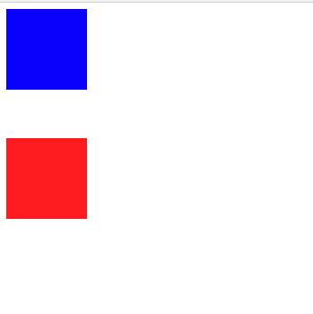
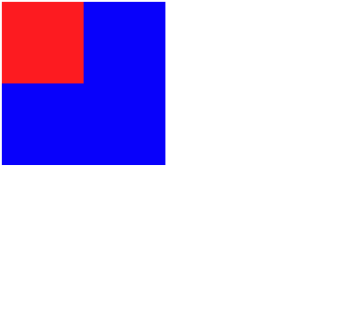

# interview

## HTML/CSS

- 1.什么是语义化的HTML,语义化的HTML有什么用?

可以分,对用户、开发者、搜索引擎优化来回答

- 2.行内元素和块级元素的区别,分别举例3个

```
img / input / a
div / h1 / p / header / main / footer / ul / tr / td 
```

- 3.浮动的表现,以及常见的闭合浮动的方式,简单说说他们能清除浮动的原理

- 4.盒模型由什么哪些组成? 

- 5.解释什么是外边距合并现象 、外边距的塌陷现象(或者根据代码,回答)



啊

